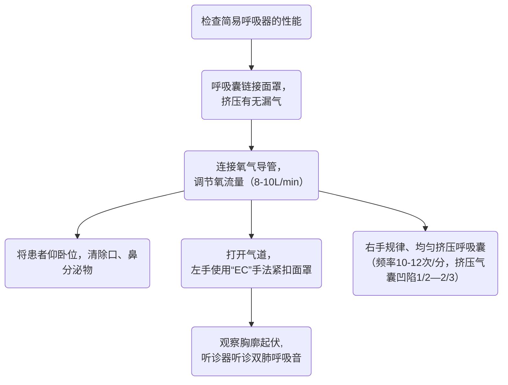

```mermaid
graph TD;
A(检查简易呼吸器的性能)-->B(呼吸囊链接面罩，</br>挤压有无漏气)
B-->C(连接氧气导管，</br>调节氧流量（8-10L/min）)
C-->D1(将患者仰卧位，清除口、鼻分泌物)
C-->D2(打开气道，</br>左手使用“EC”手法紧扣面罩)
C-->D3(右手规律、均匀挤压呼吸囊</br>（频率10-12次/分，挤压气囊凹陷1/2—2/3）)
D2-->E(观察胸廓起伏,</br>听诊器听诊双肺呼吸音)
```

